# Central Flow Collector

<div align="center">

**High-performance network flow collection and operational analytics for NetFlow, IPFIX, and sFlow**

[](project.json)
[](go.mod)
[](LICENSE)
[](#installation)

[English](README.md) · [Türkçe](README.tr.md) · [Documentation](docs/) · [OpenAPI](openapi.yaml) · [Issues](https://github.com/cumakurt/central-flow-collector/issues)

</div>

Central Flow Collector is a self-hosted, single-organization platform that receives network flow telemetry, normalizes it into a common model, stores it locally or in ClickHouse, and turns it into searchable operational insight. It combines UDP, TCP, and Linux SCTP flow listeners, a web portal, an authenticated API, reporting, health monitoring, and repeatable benchmark tools in one statically compiled Go distribution.

It is built for flow visibility and capacity analysis. It does **not** store packet payloads and is not an NDR, SIEM, SOAR, IDS/IPS, or packet-capture system.

## Contents

- [Highlights](#highlights)
- [Capabilities](#capabilities)
- [Supported protocols](#supported-protocols)
- [Architecture](#architecture)
- [Quick start](#quick-start)
- [Installation](#installation)
- [Configuration](#configuration)
- [Authentication and API](#authentication-and-api)
- [Operations and security](#operations-and-security)
- [Performance and sizing](#performance-and-sizing)
- [Development](#development)
- [Troubleshooting](#troubleshooting)
- [Documentation](#documentation)
- [License](#license)

## Highlights

- **One normalized view:** NetFlow v1/v5/v7/v8/v9, IPFIX, and sFlow data share the same query and visualization model.
- **Operational drill-down:** move from dashboards and Top-N rankings to conversations, endpoints, networks, and raw records while preserving filters and time ranges.
- **Server-side analytics:** totals, unique entities, adaptive time series, matrices, period comparisons, P95 bandwidth, and peak intervals are computed close to storage.
- **Storage choice:** start with dependency-free local JSONL files, then use ClickHouse for sustained high-volume retention and aggregate queries.
- **Bounded resource use:** listener queues, storage queues, analytics cardinality, result sizes, and query duration have explicit limits.
- **Production controls:** RBAC, MFA/passkeys, OIDC, LDAP, scoped API tokens, exporter policy, audit integrity, backup/restore, notifications, and durable ClickHouse spooling.
- **Portable artifacts:** static Linux binaries for amd64 and arm64 plus systemd, Docker Compose, and Helm deployment assets.

## Capabilities

### Collection and normalization

- Concurrent UDP listeners and framed IPFIX TCP/SCTP listeners with configurable workers, receive buffers, queues, and batch sizes.
- NetFlow v1/v5/v7/v8/v9, IPFIX/NetFlow v10, and sFlow v5 decoding.
- Cisco-compatible NetFlow v8 aggregation schemes 1–14 are normalized as aggregate flows.
- Exporter, transport, source-port, listener, and observation-domain isolation for v9/IPFIX templates, including scoped options metadata.
- A common model for addresses, ports, protocols, counters, interfaces, ASNs, countries, sites, applications, NAT fields, TCP flags, and exporter metadata when supplied.
- Optional CIDR-based Geo/ASN/site enrichment with remote fallback for public addresses.
- Exporter allow/deny policy, packet-rate limits, deduplication, and bounded analytics state.

### Explore and analyze

- Overview and analyst dashboards backed by the same aggregate query layer.
- Flow Explorer with server-side filtering, cursor pagination, saved views, URL state, drill-down, and CSV/JSON export.
- Top talkers, traffic trends, Service Timeline, Service Mix, hourly heatmap, bidirectional conversations, traffic matrix, routing, QoS/DSCP, NAT, and field-coverage views.
- Endpoint, peer, subnet, ASN, country, application, protocol, interface, exporter, and IP-centric analysis.
- Capacity lens, traffic baseline/deviation, distribution analysis, P95 bandwidth, and peak-interval inspection.
- Up to eight simultaneous service, port, IP protocol, or exporter-application series with linear, logarithmic, and automatic chart scales.

### Reports and operations

- On-demand PDF, XLSX, CSV, and JSON reports using the active time range and filters.
- Daily, weekly, and monthly scheduled reports with pause/resume, run-now, retained artifacts, email recipients, and webhook delivery.
- Listener, exporter, queue, decoder, storage, and node health visibility.
- Notification channels, integrity-chained audit logs, administration, backup/restore, and repair checks.
- Durable CRC-protected spool/WAL replay when ClickHouse is temporarily unavailable.
- `flowgen`, `flowbench`, `querybench`, and `chbench` validation and performance tools.

## Supported protocols

| Protocol | Transport | Status | Default port | Notes |
| --- | --- | --- | ---: | --- |
| NetFlow v5 | UDP | Supported | `2055` | Fixed IPv4 records and sampling metadata |
| NetFlow v1 / v7 | UDP | Supported decoding | `2055` | Legacy fixed IPv4 records; v7 validity flags retained as metadata |
| NetFlow v8 | UDP | Supported decoding | `2055` | Cisco aggregation schemes 1–14; aggregate counters and keys |
| NetFlow v9 | UDP | Supported baseline | `2055` | Template/data sets and common information elements |
| IPFIX / NetFlow v10 | UDP, TCP, SCTP | Supported | `4739` | Templates, enterprise IEs, variable-length fields, options, and framed streams |
| sFlow v5 | UDP | Supported baseline | `6343` | Flow samples, expanded samples, IPv4/IPv6, and raw-header metadata |

Onboarding profiles cover 20 vendor families, including Cisco, Juniper, Huawei/H3C, MikroTik, Fortinet, Palo Alto, Check Point, SonicWall, Arista, Aruba/HPE, Dell, Extreme, NVIDIA, Ruijie, Nokia, VMware, NetScaler, F5, and Ubiquiti. Compatibility uses supported NetFlow/IPFIX/sFlow modes; private field interpretation varies. IPFIX over UDP, TCP, and SCTP plus NetFlow v8 aggregation are supported; TLS/DTLS requires an external terminator. See [Vendor compatibility](docs/VENDOR_COMPATIBILITY.md) and [Protocol support](docs/PROTOCOLS.md).

## Architecture

```text
Routers / switches / probes
          │ NetFlow v1/v5/v7/v8/v9 · sFlow over UDP
          │ IPFIX over UDP, TCP, or SCTP
          ▼
┌─────────────────────────────────────────────────────────┐
│ listener → bounded queue → decoder → normalized flow    │
│                      ↓                                  │
│     policy → enrichment → dedup → operational analytics │
│                      ↓                                  │
│              asynchronous storage batches               │
└───────────────────────┬─────────────────────────────────┘
                        │
          ┌─────────────┴─────────────┐
          ▼                           ▼
   Local JSONL                  ClickHouse
   simple / lab                 scale / retention / rollups
                                      │
                               spool/WAL on failure

Browser / API client → authentication + RBAC
                     → aggregate queries → explorer / dashboards / reports
```

Each listener owns a bounded packet queue. Linux can batch datagram reads with `recvmmsg`; decoder workers turn packets into normalized flows. Storage writes are asynchronous, while portal views and reports use the same analytics contract. See [Architecture](docs/ARCHITECTURE.md).

## Quick start

Ready-to-run Linux binaries are included in `dist/`. To start with local storage:

```bash
cp config.example.yaml config.local.yaml
mkdir -p .local-data/enrichment

# In config.local.yaml, point storage.data_dir, security.bootstrap_file,
# and analytics.baseline_state_file to writable paths under .local-data.
./dist/flowcollector-linux-amd64 config validate --config ./config.local.yaml
./dist/flowcollector-linux-amd64 run --config ./config.local.yaml
```

The installer and default configuration bind the management portal to `0.0.0.0`. It prints the primary WAN address detected from the host routing table in the installation summary. Open that address on port `8080`. On first start, the collector writes a bootstrap administrator credential to `security.bootstrap_file`. Sign in, change the temporary password, and remove the bootstrap file.

Upgrades through `install.sh`, `install-portable.sh`, or `install.ps1` also apply this bind, including any saved portal override in `admin-settings.json`. Pass `--web-bind 127.0.0.1` (PowerShell: `-WebBind 127.0.0.1`) if you intentionally require loopback. The installer backs up changed settings. `0.0.0.0` listens on all IPv4 interfaces, including the WAN interface; the detected address is used for the access URL. An explicit `FLOWCOLLECTOR_WEB_BIND` in the service environment still takes precedence. Startup logs show the actual **Web listen address** separately from the local access URL.

To apply the fix to an existing Linux service from this checkout, run `sudo ./install.sh --web-bind 0.0.0.0`. Replacing a binary or installing a DEB/RPM alone preserves existing configuration; use the installer to migrate it and restart the service. Check the result with `sudo ss -ltnp 'sport = :8080'` (substitute your configured web port).

Management access can be restricted from **System → Admin Settings → Management access policy**. Rules accept IPv4/IPv6 addresses and CIDRs, are evaluated in order, and support `allow` or `deny` actions with an explicit default action. The policy is stored atomically in `access-policy.json` under the data directory and is enforced for the portal and API; health, readiness, and metrics remain available for monitoring.

### Portal preview

The screenshots below were captured from a local instance populated with generated NetFlow traffic. They cover the overview, flow explorer, and the management access policy screen.

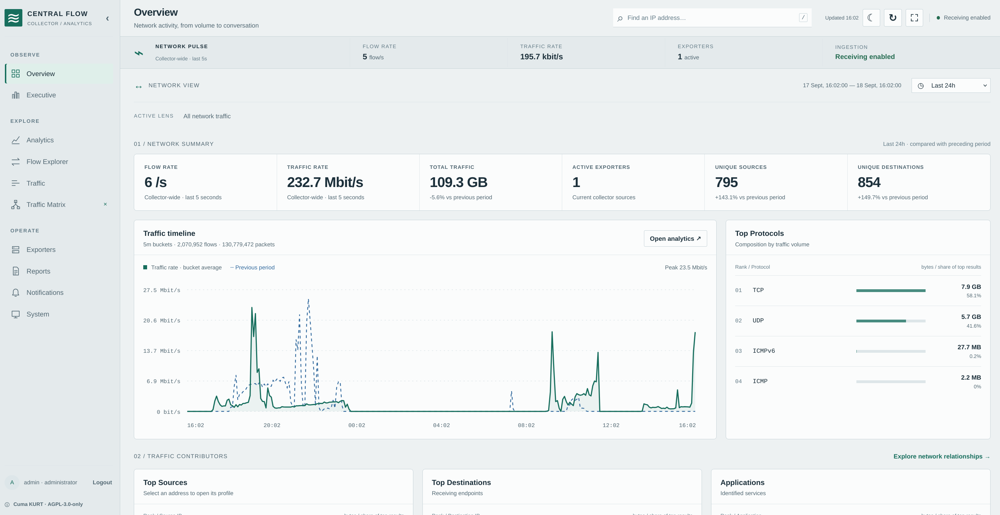
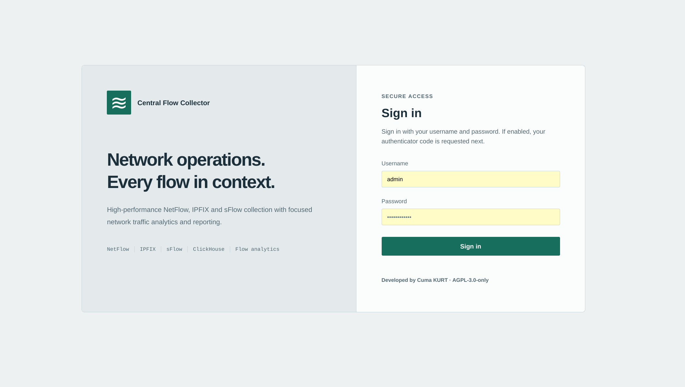

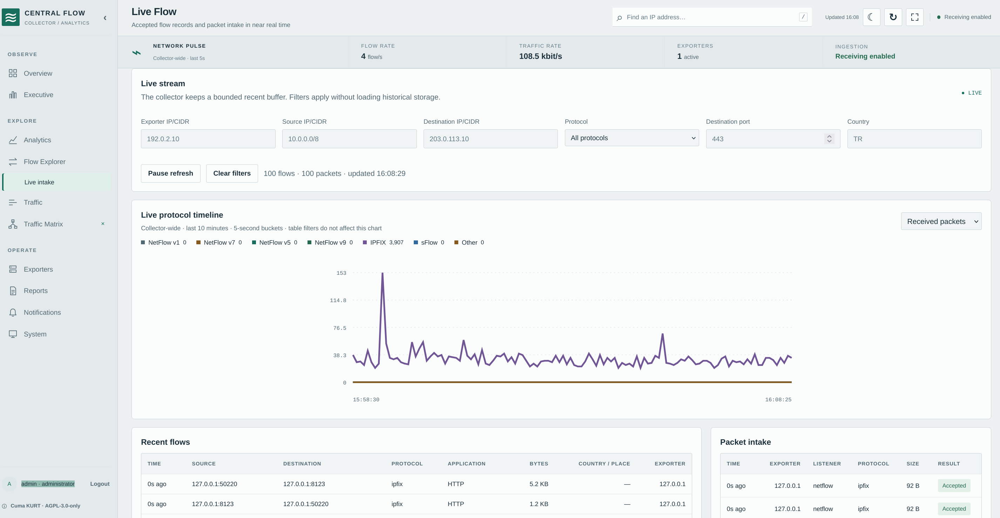

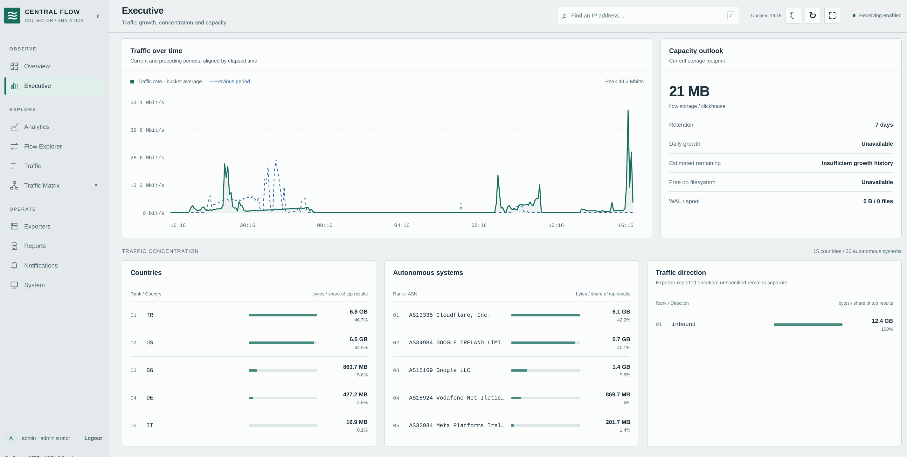

Additional capability screens captured from the same generated-traffic run:

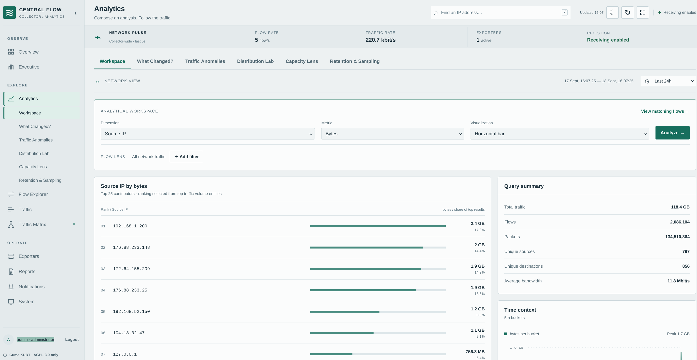
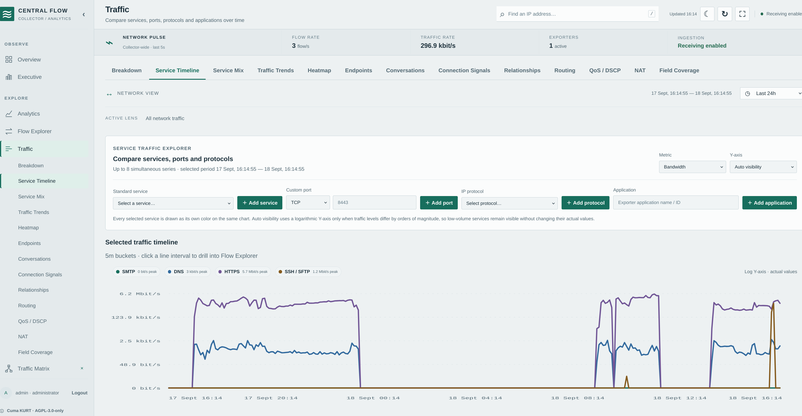
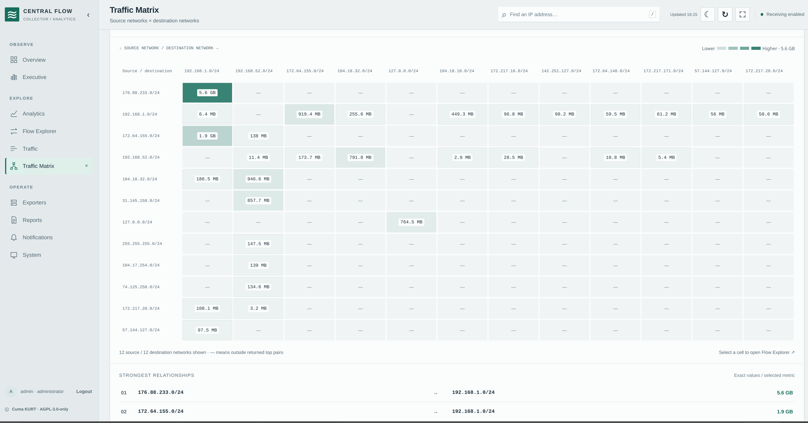
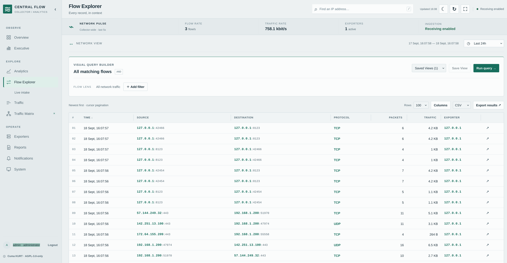
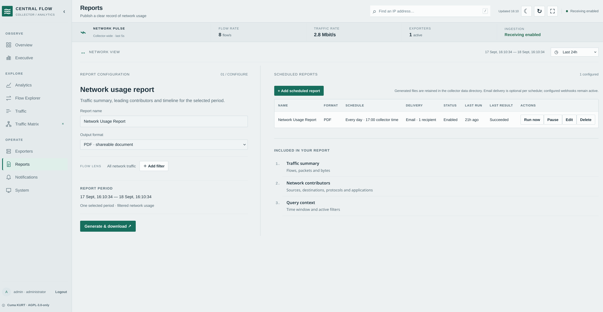
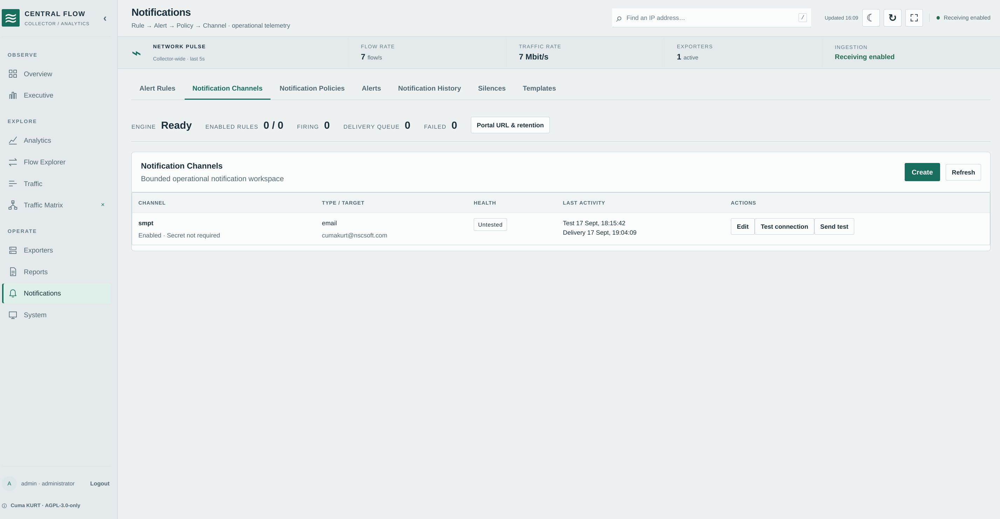
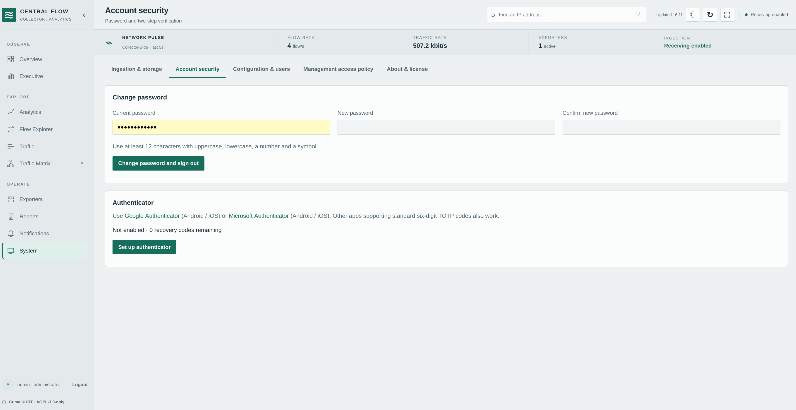
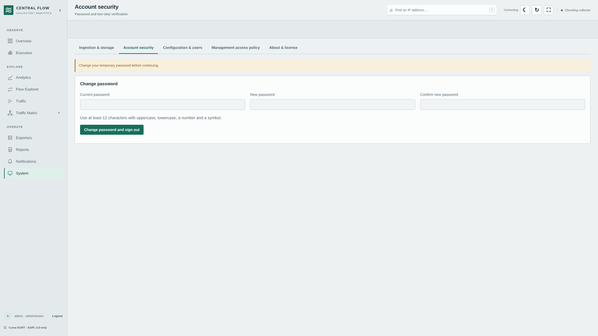
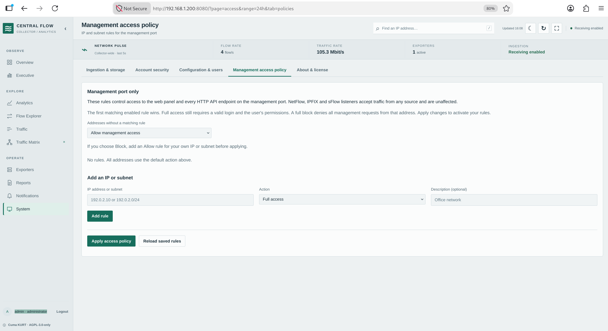

Send synthetic NetFlow v5 traffic:

```bash
./dist/flowgen-linux-amd64 \
  -protocol netflow5 \
  -target 127.0.0.1:2055 \
  -rate 100 \
  -count 1000
```

Choose the binary matching your host: `amd64` or `arm64`.

## Installation

### Automated systemd installer

On a Linux host with systemd:

```bash
sudo ./install.sh
```

A fresh default installation creates the service account and directories, installs a hardened systemd service, starts ClickHouse in Docker, configures the collector, and validates health. Existing installations are detected and upgraded in place with a rollback snapshot.

```bash
# Dependency-free local JSONL storage
sudo ./install.sh --local-storage

# Require an existing installation and create an upgrade snapshot
sudo ./install.sh --upgrade

# Use remote ClickHouse
sudo ./install.sh \
  --clickhouse-host clickhouse.example.net \
  --clickhouse-scheme https \
  --clickhouse-user flowcollector \
  --clickhouse-password-file /secure/clickhouse-password

# Restore the latest installer snapshot
sudo ./install.sh --rollback
```

| Purpose | Default path |
| --- | --- |
| Binary | `/usr/local/bin/flowcollector` |
| Configuration | `/etc/flowcollector/config.yaml` |
| Persistent data | `/var/lib/flowcollector` |
| Logs | `/var/log/flowcollector` and systemd journal |
| Service unit | `/etc/systemd/system/flowcollector.service` |

Run `sudo ./install.sh --help` for TLS, clustering, ClickHouse, path, and service options. Package notes are available for [Debian](packaging/deb/README.md) and [RPM](packaging/rpm/README.md).

### Windows

Run PowerShell as Administrator and execute the native installer. It installs
the executable and configuration below `Program Files`, stores mutable data
under `ProgramData`, validates the configuration, and optionally registers a
`CentralFlowCollector` Windows service:

```powershell
Set-ExecutionPolicy -Scope Process Bypass
.\install.ps1 -Version 4.0.0
Get-Service CentralFlowCollector
```

The script uses `dist\flowcollector-windows-amd64.exe` or the matching ARM64
artifact when present, otherwise it builds from the local source tree when Go
is installed. Use `-NoService -NoStart` for a foreground/manual deployment,
`-Force` for an upgrade, and `uninstall.ps1 -PurgeData` only when the stored
flows and configuration should also be removed. Windows builds support UDP
listeners; IPFIX TCP is available through the same listener configuration.
SCTP requires the Linux build.

### macOS, FreeBSD, and other Unix systems

Use the portable installer when systemd is not available:

```sh
./install-portable.sh --prefix "$HOME/.local" \
  --config-dir "$HOME/.config/flowcollector" \
  --data-dir "$HOME/.local/share/flowcollector" \
  --no-service
```

As root, the defaults install under `/usr/local`, `/usr/local/etc/flowcollector`,
and `/var/lib/flowcollector`. The script selects the host OS/architecture,
uses a matching `dist/` artifact, or compiles from source with Go. macOS gets a
LaunchAgent/LaunchDaemon definition; FreeBSD receives an explicit rc.d
integration notice. Remove files with `./uninstall-portable.sh`; data is kept
unless `--purge-data` is supplied.

### Docker Compose

```bash
cd deploy/docker
export CLICKHOUSE_PASSWORD='replace-with-a-strong-password'
docker compose up --build -d
docker compose ps
```

The development/POC stack runs ClickHouse and exposes TCP `8080` and UDP `2055`, `4739`, and `6343`. Review credentials, TLS, bind addresses, volumes, resource limits, and backups before production use.

### Kubernetes / Helm

```bash
helm upgrade --install flowcollector \
  deploy/helm/central-flow-collector \
  --namespace flowcollector \
  --create-namespace
```

The chart defaults to one replica, a `LoadBalancer` service, local storage, and a 20 GiB persistent volume. Supply production secrets with Kubernetes Secrets or an external secret manager.

### Prebuilt artifacts

`dist/` contains Linux amd64/arm64 binaries, Debian packages, an RPM, checksums, licenses, and release metadata:

```bash
cd dist
sha256sum --check checksums.txt
```

## Configuration

[`config.example.yaml`](config.example.yaml) is the canonical reference. Validate every change before restarting:

```bash
flowcollector config validate --config /etc/flowcollector/config.yaml
```

| Section | Purpose | Key defaults |
| --- | --- | --- |
| `node` | Node identity and region | generated/empty ID, region `default` |
| `web` | Portal/API bind and TLS | `0.0.0.0:8080`, TLS off |
| `storage` | Local or ClickHouse persistence | local, 7-day retention |
| `security` | Sessions, bootstrap, MFA policy, limits | default deny, 8-hour session |
| `oidc`, `ldap` | External identity providers | disabled |
| `logging` | Structured logging | JSON, `info` |
| `enrichment` | CIDR Geo/ASN/site and remote lookup | enabled |
| `analytics` | Baseline, dedup, cardinality bounds | baseline and dedup enabled |
| `notifications` | Webhook, Telegram, SMTP, syslog | unset |
| `cluster` | Heartbeats, global dedup, mTLS | one expected node |
| `listeners` | UDP or IPFIX TCP/SCTP endpoints and queue/worker tuning | ports 2055, 4739, 6343 |

An IPFIX stream listener is configured explicitly; TCP and SCTP are not
accepted for NetFlow or sFlow listeners:

```yaml
listeners:
  - name: ipfix-tcp
    bind: "0.0.0.0"
    port: 4739
    protocol: ipfix
    transport: tcp
    workers: 4
    queue_size: 8192
    batch_size: 16
    enabled: true
  # On Linux, use transport: sctp for RFC 7011 SCTP exporters.
```

The collector reads one complete IPFIX message at a time from each stream and
isolates templates by exporter, transport/source port, listener, observation
domain, and template ID. TLS/DTLS is intentionally terminated by a proxy or
load balancer before the listener.

Load secrets without embedding values in YAML:

```yaml
storage:
  clickhouse_password: "@env:FLOWCOLLECTOR_CLICKHOUSE_PASSWORD"

oidc:
  client_secret: "@file:/etc/flowcollector/secrets/oidc-client-secret"
```

Environment variables can override settings in container deployments; the Compose file demonstrates the naming convention. Keep passwords, tokens, and private keys out of source control. See [Configuration](docs/CONFIGURATION.md).

### Choosing storage

Use **local storage** for evaluation, labs, modest rates, and simple single-node installations. It writes JSONL segments below `storage.data_dir` and requires no database.

Use **ClickHouse** for sustained high ingestion, longer retention at volume, fast aggregate analysis, rollups, and replicated/distributed storage. Tune batching, queues, query limits, retention, and spool size for the host. UDP sender success only proves a datagram was written; monitor collector drops and storage health to verify ingestion.

## Authentication and API

The single organization has three canonical roles:

| Role | Intended access |
| --- | --- |
| `administrator` | Users, settings, policies, reports, operations, and all analysis |
| `analyst` | Investigation, analysis, views, and permitted operational workflows |
| `read_only` | View dashboards, flows, health, and report jobs |

Authentication can use local accounts, OIDC, or LDAP. Local accounts support TOTP MFA and WebAuthn/passkeys. API clients use hashed, scoped Bearer tokens with optional expiry and source-CIDR restrictions.

The complete API contract is in [`openapi.yaml`](openapi.yaml). Browser sessions use the `fc_session` cookie and require `X-CSRF-Token` for mutations.

```bash
curl -H "Authorization: Bearer ${FLOWCOLLECTOR_TOKEN}" \
  "http://127.0.0.1:8080/api/v1/analytics?from=2026-09-17T08:00:00Z&to=2026-09-17T09:00:00Z"
```

Key routes:

- `GET /health` and `GET /ready` — liveness and readiness.
- `GET /api/v1/analytics` — totals, Top-N dimensions, and timeline.
- `GET /api/v1/flows/page` — cursor-paginated flows.
- `GET /api/v1/assets`, `/conversations`, and `/ip/{ip}` — entity analysis.
- `GET /api/v1/exporters/health` — exporter health.
- `POST /api/v1/reports/export` — PDF/XLSX/CSV/JSON output.
- `GET /api/v1/live/events` — authenticated server-sent events.

Documented analytical time ranges use inclusive RFC3339 `from`/`to` values and are limited to 31 days. See the [API guide](docs/API.md) for filters and limits.

### Command-line administration

```bash
flowcollector version
flowcollector health --url http://127.0.0.1:8080/health
flowcollector diagnostics --config /etc/flowcollector/config.yaml
flowcollector user reset-password --config /etc/flowcollector/config.yaml --username admin
flowcollector policy test --config /etc/flowcollector/config.yaml \
  --source 10.0.0.1 --protocol netflow --listener netflow --port 2055
flowcollector audit verify --config /etc/flowcollector/config.yaml
flowcollector repair check --config /etc/flowcollector/config.yaml
```

Run `flowcollector --help` for the complete command inventory.

#### Local-console password recovery

The portal deliberately has no “forgot password” endpoint. This prevents a remotely reachable management page from becoming a password-reset channel. An operator with access to the collector host must run the reset command from its local console (or through an already authenticated administrative shell). The command invalidates every active session for that user and clears the temporary-password flag.

The safest interactive form does not expose the new password in shell history, process listings, service logs, or terminal output:

```bash
sudo /usr/local/bin/flowcollector user reset-password \
  --config /etc/flowcollector/config.yaml \
  --username alice
# New password (hidden):
# Repeat new password (hidden):
```

The two entries must match and satisfy the normal password policy (at least 12 characters with upper/lowercase, a number, and a symbol). Existing sessions are revoked immediately, so the user must sign in again. For a non-interactive recovery job, provide exactly two newline-separated values on stdin; this keeps the password out of the command line while allowing console automation:

```bash
printf '%s\n%s\n' 'New-Strong-Pass_42' 'New-Strong-Pass_42' |
  sudo /usr/local/bin/flowcollector user reset-password \
    --config /etc/flowcollector/config.yaml --username alice
```

The `--password` option remains only for tightly controlled automation compatibility and is discouraged because command-line arguments can be visible to other local processes. Never place a reset password in a shared script or ticket. The command must be run with permission to read the configuration and write the configured data directory.

## Operations and security

Use `/health` for liveness and `/ready` for dependency readiness. The portal shows queue utilization, packet/flow counts, drops, decoder errors, exporter sequence/template status, storage errors, and capacity where supported. Logs are structured JSON by default.

Diagnostics and pprof are disabled by default. Enable them only on a protected management interface. Do not expose the HTTP portal directly to an untrusted network; terminate TLS at the collector or a suitably configured reverse proxy.

### Backup and restore

```bash
# Add --include-flows to include local JSONL flow data
flowcollector backup create \
  --config /etc/flowcollector/config.yaml \
  --output /secure/flowcollector-backup.tar.gz

flowcollector backup verify --archive /secure/flowcollector-backup.tar.gz

# Stop the service before restoring
flowcollector restore \
  --config /etc/flowcollector/config.yaml \
  --archive /secure/flowcollector-backup.tar.gz \
  --force
flowcollector repair check --config /etc/flowcollector/config.yaml
```

Application backup excludes local flows unless `--include-flows` is supplied and does not copy ClickHouse tables. Use native ClickHouse backup/replication for production data, or `clickhouse-backup` commands for streaming JSONL export/import. See [Backup and restore](docs/BACKUP_RESTORE.md).

### Production checklist

- Replace bootstrap credentials and remove the bootstrap file.
- Put the portal behind TLS and restrict management access.
- Store secrets through `@env:` or protected `@file:` references.
- Configure exporter policy and realistic packet-rate limits.
- Size UDP buffers, queues, storage, and retention from measured traffic.
- Monitor listener drops separately from storage drops and write errors.
- Configure backups and test restoration away from production.
- Verify notification endpoints and scheduled-report delivery.
- Keep diagnostics disabled unless actively troubleshooting.
- Re-run `flowbench` and `querybench` on the production topology.

Read [Security](docs/SECURITY.md), [Administration](docs/ADMINISTRATION.md), and [Troubleshooting](docs/TROUBLESHOOTING.md) before an internet-adjacent or high-volume deployment.

## Performance and sizing

On a 5-vCPU AMD EPYC sandbox with local storage and production analytics/dedup enabled, dense-packet tests across all supported protocols reached roughly **205–210k flows/s** without listener or storage drops. For that measured class, use **≤140k flows/s sustained** as a conservative target, treat about **180k flows/s** as high utilization, and about **200k flows/s** as critical. These figures describe one environment and are not a production guarantee.

Local JSONL used about **451 bytes per flow** in the measured fixture and becomes the practical constraint for high-rate, multi-day retention. Use ClickHouse for that workload and benchmark the real infrastructure.

| Profile | Compute | Storage / network | Typical use |
| --- | --- | --- | --- |
| Lab | 2 vCPU, 4 GiB | SSD | Evaluation and low-rate collection |
| Standard | 4–6 modern vCPU, 8 GiB | SSD/NVMe | General single-node operation |
| High traffic | 8 vCPU, 16 GiB | NVMe, 10 GbE | Higher ingestion with ClickHouse |

```bash
./dist/flowbench-linux-amd64 \
  -protocol netflow5 -target 127.0.0.1:2055 \
  -flows-per-packet 30 -workers 4 -pps 7000 -duration 30s

./dist/querybench-linux-amd64 -rows 50000 -iterations 5
```

See [Performance](docs/PERFORMANCE.md) for methodology and cautions.

## Development

Requirements: Go 1.23+, GNU Make, and `sha256sum` or `shasum`. Python 3 is used for SBOM generation. Packaging targets additionally need their corresponding tools.

```bash
make build VERSION=4.0.0             # Linux amd64
make static VERSION=4.0.0            # all five tools, Linux amd64 + arm64
TARGETS='darwin/amd64 darwin/arm64 windows/amd64 freebsd/amd64' \
  ./scripts/build-static.sh           # additional portable OS artifacts
make test
make vet
make benchmark
make query-benchmark
make package VERSION=4.0.0 COMMIT=release-v4.0.0
make release-check
```

The browser interface is dependency-free JavaScript/CSS embedded in the binary; there is no frontend install or bundling step.

```bash
go test ./...
go vet ./...
go build ./...
node --test \
  scripts/ui/state.test.cjs \
  scripts/ui/insight-state.test.cjs \
  scripts/ui/traffic-visuals-state.test.cjs
```

### Project layout

```text
cmd/                    executable entry points
internal/               collector, decoders, API, auth, analytics, storage
internal/api/static/    embedded browser portal
migrations/clickhouse/  ClickHouse schema and rollups
deploy/                 Docker, Helm, and systemd assets
docs/                   architecture, operations, API, security, and UI guides
scripts/                build, package, release, and UI validation tools
testdata/                test fixtures
validation/              retained release-validation evidence
dist/                    prebuilt binaries and packages
```

## Troubleshooting

**The portal does not open:** check the detected management address, `web.bind`, firewall rules, service status, and `flowcollector health`. If the management access policy has a deny default, add a trusted administrator CIDR before saving. Apply TLS before using a non-loopback bind on an untrusted network.

**Service charts show zero:** confirm stored flows contain source/destination ports. Protocol-only views also require `ip_protocol`; they do not infer it from a port. Check exporter templates and field coverage.

**Flows are sent but do not appear:** verify protocol, transport, port, firewall, exporter policy, listener counters, decoder errors, queue drops, and storage health. For IPFIX streams, set `protocol: ipfix` and `transport: tcp` or `transport: sctp`; for SCTP use a Linux build. Sender success does not confirm collector acceptance.

**A scheduled report is not delivered:** inspect the job result, email toggle and recipients, notification channels, SMTP/webhook settings, and audit log. Test DNS, TCP, TLS, authentication, and recipient acceptance from the host.

**The UI is stale after an upgrade:** restart with the rebuilt binary and hard-refresh the browser; frontend assets are embedded.

See [Troubleshooting](docs/TROUBLESHOOTING.md) for detailed procedures.

## Documentation

| Guide | Scope |
| --- | --- |
| [Installation](docs/INSTALL.md) | Binary, systemd, container, and host considerations |
| [Configuration](docs/CONFIGURATION.md) | Settings, secrets, and storage controls |
| [Architecture](docs/ARCHITECTURE.md) | Data path, organization model, and scale |
| [API](docs/API.md) / [OpenAPI](openapi.yaml) | Authentication, routes, filters, and schema |
| [Analysis views](docs/ANALYSIS-VIEWS.md) | Methods, rankings, and drill-down |
| [Security](docs/SECURITY.md) | Identity, tokens, browser controls, and audit |
| [Administration](docs/ADMINISTRATION.md) | Day-to-day operations |
| [Backup and restore](docs/BACKUP_RESTORE.md) | Archives, verification, and restoration |
| [Performance](docs/PERFORMANCE.md) | Benchmarks, sizing, and tools |
| [Containers](docs/CONTAINERS.md) | Docker/Podman and Kubernetes |
| [Clustering](docs/CLUSTER.md) | Heartbeats, global deduplication, and mTLS |
| [Upgrade to 4.0.0](docs/UPGRADE_4.0.0.md) | Compatibility and migration |
| [Release status](docs/RELEASE_STATUS.md) | Current validation status |

## Scope and data interpretation

Flow telemetry contains metadata and counters exported by network devices. Packet counts shown in the portal are counters from flow records, not stored payloads. Baseline deviations indicate operational traffic-volume changes and do not classify attacks. Interpret application, country, ASN, NAT, interface, and TCP fields according to what each exporter supplies.

## License

Copyright 2026 Cuma KURT and Central Flow Collector contributors.

Licensed under the **GNU Affero General Public License, version 3 only** (`AGPL-3.0-only`). See [LICENSE](LICENSE) and [NOTICE](NOTICE). Modified network-accessible deployments must provide corresponding source as required by the license.

Developed by **Cuma KURT**  
[GitHub](https://github.com/cumakurt/central-flow-collector) · [LinkedIn](https://www.linkedin.com/in/cuma-kurt-34414917/) · [Email](mailto:cumakurt@gmail.com)
